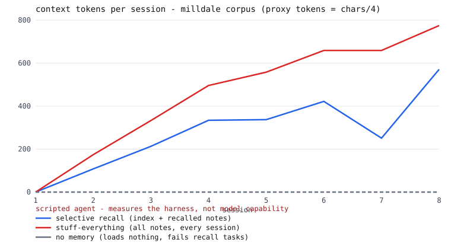
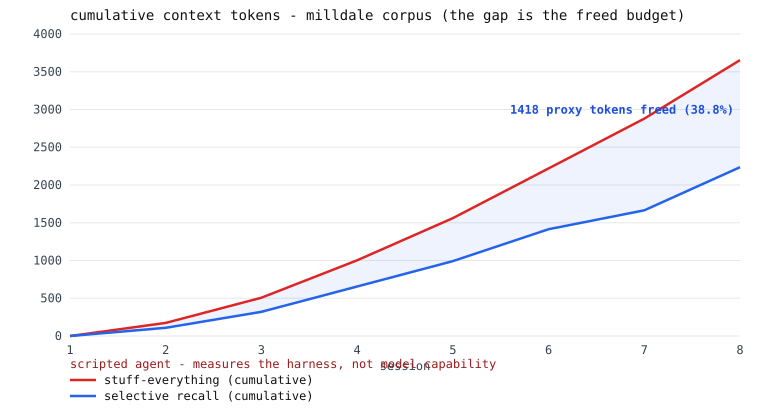

# wiki-memory-lab



**An agent whose long-term memory is a human-readable markdown wiki it reads,
extends, and prunes** — replay 8 scripted sessions with zero API keys and watch
selective recall, extend-before-create, and prune-with-a-written-reason happen
in plain text files.

> **Every number below regenerates in CI with zero API keys — if a claim
> drifts, the build fails.** (`pytest` → full run → report → `git diff
> --exit-code`, on Windows and Linux.) The bundled agent is scripted: it
> measures the harness, never model capability — see *What this does NOT show*.

**🎛 Interactive walkthrough:** [lzbiala.github.io/wiki-memory-lab/docs](https://lzbiala.github.io/wiki-memory-lab/docs/) —
step through a real session (including the prune moment) in your browser, or open
[`docs/index.html`](docs/index.html) straight from a clone. Static file, no build
system, no external requests.

## The idea in 30 seconds

Most AI assistants either forget everything between chats or reread their
entire diary before every answer — slow and wasteful. This one keeps a **recipe
box** instead: at the start of a session it skims the card titles, pulls only
the two or three cards today's question needs, updates those cards afterward,
and throws out any card proven wrong. And the box is just plain text — open the
folder in any editor and read your AI's whole memory yourself.

The idea of keeping an agent's memory as a human-readable markdown wiki it
maintains itself is [Andrej Karpathy's](https://karpathy.ai/) — this lab builds
that concept small and then **measures it**. No affiliation; just attribution.

**What this is NOT:** not a vector database, not an embedding store, not a chat
product, and not a claim that any model "gets smarter." It is a memory
protocol, an audit log, and a harness that measures both.

## Quickstart (three commands, no keys)

```
git clone <this-repo> && cd wiki-memory-lab
pip install -e .          # installs nothing but this package — runtime is stdlib-only
python -m wikimemlab demo
```

Twenty seconds later you have freshly computed curves, transcripts, and a wiki
you can open in a text editor.

## What you just watched: one session, anatomized

Every session follows the same loop — **load index → selective recall → answer
→ write-back → decay** — and every memory operation carries a written reason.
This excerpt is quoted from `runs/milldale-session_06.md`, a generated and
committed file that CI regenerates on every push — open it and check the quote:

```
## task s6t3 — "Can I still catch the route 4 bus by the square tonight?"
RECALL: bus-schedule (1 note(s) / 53 tokens)
ANSWER: No — the town notice posted today says route 4 is discontinued; a new
route 7 now runs from the square. [...]
WRITE-BACK: CREATE walk-in-clinic-hours — same clinic as the existing note — a
paraphrased title the exact matcher will miss, counted as false-CREATE
[intended EXTEND — counted as false-CREATE]

CORRECTION: PRUNE bus-schedule — contradicted by session 6 town notice: route 4 discontinued
CORRECTION: CREATE bus-route-7 — replacement for pruned bus-schedule
DECAY: ARCHIVE school-play — not created or recalled inside the decay window
```

That `PRUNE ... — contradicted by ...` line is the whole point: **memory that
deletes what is proven wrong, with a reason a human can audit later.** An
unrecorded deletion is a mystery; this one is a log line.

## The memory protocol

```
wiki/
  index.md          ← ONE line per note (title + hook); the only thing loaded at session start
  bakery-hours.md   ← one concept per note, strict frontmatter, [[wiki-links]]
  ...
  archive/          ← pruned and decayed notes land here, never silently deleted
runs/ops.jsonl      ← every RECALL / CREATE / EXTEND / PRUNE / ARCHIVE, each with a written reason
```

- **Index-first selective recall** — skim one line per note, load only what
  scores against the task. The index is the standing overhead selective recall
  pays every session; it is measured below, not hidden.
- **Extend-before-create** — a write-back whose normalized title already
  exists extends that note. The matcher is exact on purpose; what it misses is
  counted (see the confusion row), not papered over.
- **Prune with a reason** — a note proven wrong is archived with a mandatory
  written reason. The protocol refuses an empty one.
- **One decay rule** — a note neither created nor recalled for 5 sessions is
  archived automatically. Memory that only accumulates is a junk drawer.

## Claims, treated like SLOs

Each claim ships with its measurement command and its honest caveat in the
same row. The table below is **rendered by `report.py` from `metrics.jsonl`**
— no measured number in it is typed by hand, and CI fails if regeneration
produces anything different. (Prose facts elsewhere — session counts, the
decay window — are pinned to the code and fixtures by tests.)

<!-- AUTOGEN:BEGIN — rendered by report.py from metrics.jsonl; do not edit by hand -->

| claim | number (regenerated by CI) | how measured | honest caveat |
|---|---|---|---|
| Selective recall loads fewer context tokens than stuffing the whole wiki | **2236 vs 3654 proxy tokens over 8 sessions (ratio 0.61)** | identical fixture suite, three loading policies; baselines replay the selective run's per-session wiki snapshots; proxy tokens = chars/4 | the ratio is the claim, not the absolute counts; it depends on corpus size and task locality — see the crossover row |
| Crossover: below a small corpus size, stuffing is cheaper | **mini corpus (8 notes): selective 431 vs stuff 340 proxy tokens (ratio 1.27)** | same harness on a corpus of 8 notes whose tasks touch most of it | selective recall pays the index every session; on a small, hot corpus that overhead is pure loss — the design only wins when the wiki outgrows its working set |
| One-line hooks recover the labeled relevant notes | **precision 0.95 / recall 0.95 (20/21 recalled correct, 20/21 relevant found, 1 shown miss(es))** | author-written ground-truth labels on the main corpus only (the crossover mini corpus is measured in its own row); the runner logs actual recalls | an upper bound by construction — the same author wrote tasks, hooks, and labels; the deliberately lazy hook produces the shown miss |
| Protocol conformance (labeled as such, not a benchmark) | **ops: {"ARCHIVE": 1, "CREATE": 18, "EXTEND": 1, "PRUNE": 2, "RECALL": 21}; false-CREATE 1, false-EXTEND 0** | counted from the ops log and final wiki state of the deterministic run; adversarial fixtures push the title matcher in both failure directions | proves the harness enforces the protocol and characterizes the matcher — not whether a live model would follow the protocol unprompted |
| The index is the standing price of selective recall | **246 proxy tokens for 15 notes (~16.4/note, 0.32 of full-corpus cost at session 8)** | measured directly from the generated index and final corpus | one-line hooks are a design commitment — hooks that bloat into paragraphs erode exactly the savings claimed here |
| Memory stays smaller than what it remembers | **final wiki 4983 bytes (live notes + index + archive) vs 8792 bytes of the session transcripts it was distilled from** | byte sizes of the main-corpus wiki including archived notes vs that corpus's session transcripts only | growth depends on the extend/prune discipline the protocol enforces; a corpus without corrections would grow differently |

Cumulative over the main corpus: selective recall freed **1418 proxy tokens (38.8%)** of context budget vs loading everything — and the gap widens as the wiki grows ([report/cumulative.svg](report/cumulative.svg)). Same caveats as the first row: proxy tokens, ratio-not-absolutes, corpus- and locality-dependent.

<!-- AUTOGEN:END -->

Regenerate everything yourself: `python -m wikimemlab demo --quiet && git diff`.

## Why this matters in production — the honest sell



- **Context budget is money.** Input tokens are what every metered LLM API bills for,
  session after session. The table above measures exactly how much of that budget
  index-first selective recall frees on this corpus — and the cumulative chart shows
  the gap *widening* as the wiki grows, because stuffing scales with corpus size while
  selective recall scales with the task's working set.
- **Fewer tokens is also the latency lever** — *mechanism, not a measurement*: this
  repo measures tokens, not wall-clock, but shorter prompts are the one input-side
  change that reduces both cost and time-to-first-token on every provider. If you need
  latency numbers, they belong to your stack, measured there.
- **Sub-agent fan-out multiplies the bill** — *arithmetic, not a benchmark*: an
  orchestrator that spawns N sub-agents pays the memory-loading cost N times. Whatever
  a memory policy saves per agent, fan-out multiplies. This harness measures the
  per-agent token side; your orchestrator supplies the N.
- **Auditable memory is debuggable memory.** When an agent misbehaves, the first
  question is "what did it believe, and why?" Here that's an `ls` and a grep: every
  RECALL/CREATE/EXTEND/PRUNE/ARCHIVE is one ops-log line with a written reason, and
  deleted knowledge sits in an archive with its cause of death. That is an incident
  review that takes minutes, not a forensic dig.
- **Reviewable by anyone, with no tooling.** The memory is markdown. A teammate, an
  auditor, or a hiring manager can open the folder and read what the agent knows —
  which is also why this page can show you real transcripts instead of screenshots.

Every claim in this section either points at a drift-gated number above or is labeled
as the mechanism it is. That's the product: not "memory makes agents better," but
**a measured cost structure and an audit trail you can hold to account.**

## What this does NOT show

**The circularity trap, in plain words:** the bundled agent is scripted. Its
write-backs are rule-driven and its answers come from the fixture file. A
scripted agent that is told to use memory, using memory, proves nothing about
intelligence — so this repo never publishes a "task completion" curve, because
completion tracks retrieval *by construction* here. What the harness CAN
measure honestly is the cost and behavior of the memory protocol itself: token
arithmetic, retrieval quality of one-line hooks against labeled tasks, and
whether the protocol's rules (merge, prune, decay) fire when they should —
including the two directions the title matcher fails.

Also outside what this measures: whether a live LLM follows the protocol
unprompted, open-ended answer quality, and retrieval beyond this corpus (the
same author wrote the tasks, hooks, and labels — the P/R row says "upper
bound" for that reason).

## Bring your own model (v1.1 interface)

`agents.Agent` is the seam: implement `choose_recall(prompt, metas)` and
`answer(task, recalled)` with a live model and run the same harness. No live
adapter ships in v1.0 — deliberately, so no published number can be mistaken
for model judgment. If you wire one up: watch whether the model extends
instead of duplicating, whether it writes one-line hooks (bloated hooks erode
the token savings — measured above), and whether it ever prunes without being
forced. **Live results will never appear in this README**; they belong to
whoever runs them, with their own error bars.

## Design notes for engineers

- **Why markdown over a vector store here:** the memory must be auditable by a
  human with no tooling. A wiki you can read in a text editor turns "what does
  my agent believe?" from a research question into an `ls`. At this corpus
  size, lexical hooks retrieve competitively and cost nothing to inspect.
- **Why the scorer has no stemming/embeddings:** so its failures are legible.
  "open" not matching "opening" is a visible, teachable miss — the deliberately
  lazy hook (`town-history: "assorted notes"`) exists to show exactly what a
  bad hook costs, in the transcript, on purpose.
- **Why logical session indices instead of timestamps:** wall-clock time in a
  generated artifact would make every re-run differ, and the whole trust story
  here is `git diff --exit-code` after regeneration. A test greps generated
  output for date/time patterns and fails on any hit.
- **Failure modes demonstrated on purpose:** the paraphrased-duplicate
  false-CREATE, the shown retrieval MISS, and the crossover where stuffing
  beats selective recall on a small corpus. An honest harness shows where its
  design loses.
- **What I would build next:** an invented-facts corpus a live model cannot
  know from pretraining; alias matching for the upsert matcher; an
  embedding-retrieval baseline for the same fixtures.

## Repo map, tests, CI

```
src/wikimemlab/     frontmatter, protocol (the librarian), scorer, agents, runner, report
fixtures/           milldale (8 sessions, ~20 tasks) and milldale_mini (crossover corpus)
wiki/ runs/ report/ metrics.jsonl   — generated artifacts, committed on purpose
tests/              the protocol contract, determinism, no-wall-clock, fixture integrity
tools/              blocklist_check.py — repo hygiene gate (the repo's first commit)
```

- `pytest` — the contract suite.
- `python -m wikimemlab demo --quiet` — regenerate every artifact.
- CI (Windows + Linux, pinned Python) runs: pytest → hygiene gate → full
  regeneration → `git diff --exit-code`. **The committed artifacts ARE the
  claims; CI proves they regenerate.** That is the drift gate: any change that
  alters a published number without updating the committed artifacts fails the
  build, on purpose, loudly.

## License

MIT.
